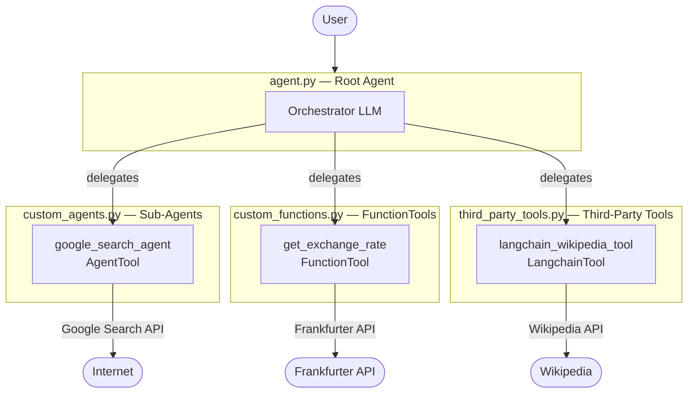
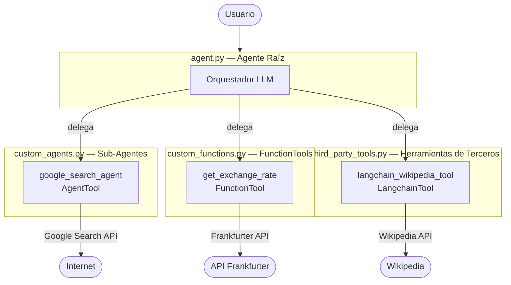

# ADK Tools Personal Assistant / Asistente Personal con ADK Tools

## English

### Overview
A multi-tool personal assistant agent built with **Google Agent Development Kit (ADK)**. This agent combines real-time search, currency exchange, and encyclopedic knowledge to answer a wide range of user queries.

### Architecture
The project follows a modular structure where a **root agent** orchestrates a set of specialised tools and sub-agents:

```
personal_assistant/
├── agent.py              # Root agent definition
├── custom_agents.py      # Sub-agents (e.g. Google Search agent)
├── custom_functions.py   # Custom Python functions as tools
├── third_party_tools.py  # LangChain / third-party tool integrations
└── __init__.py           # Package entry point
```



### Tools & Capabilities

| Tool | Type | Description |
|------|------|-------------|
| `get_exchange_rate` | `FunctionTool` | Retrieves live currency exchange rates via the [Frankfurter API](https://www.frankfurter.app/) |
| `google_search_agent` | `AgentTool` | A sub-agent that uses Google Search to answer questions about current events, weather, and business hours |
| `langchain_wikipedia_tool` | `LangchainTool` | Provides historical and cultural information about landmarks and concepts using Wikipedia |

### Getting Started

#### Prerequisites
- Python 3.10+
- A valid **Google AI / Gemini API key**

#### Installation
```bash
pip install google-adk langchain-community wikipedia
```

#### Configuration
Create a `.env` file in the project root and add your credentials. You may use either a **Gemini API key** or **Vertex AI** (Google Cloud):

**Option 1 – Gemini API key:**
```env
GOOGLE_API_KEY=your_api_key_here
```

**Option 2 – Vertex AI (Google Cloud):**
```env
GOOGLE_GENAI_USE_VERTEXAI=true
GOOGLE_CLOUD_PROJECT=your_google_cloud_project_id
GOOGLE_CLOUD_LOCATION=your_google_cloud_region
```

| Variable | Description |
|----------|-------------|
| `GOOGLE_API_KEY` | Gemini API key (Option 1 only) |
| `GOOGLE_GENAI_USE_VERTEXAI` | Set to `true` to use Vertex AI instead of the Gemini API |
| `GOOGLE_CLOUD_PROJECT` | Your Google Cloud project ID (Option 2 only) |
| `GOOGLE_CLOUD_LOCATION` | Google Cloud region, e.g. `us-central1` (Option 2 only) |

#### Running the Agent
```bash
adk run personal_assistant
```

Or launch the interactive web UI:
```bash
adk web
```

### Web Application (React + Firebase)

A full-featured React web application with Firebase authentication and conversation persistence is available in the `frontend/` directory.

#### Quick Start with Docker 🐳

The easiest way to run the complete application locally:

1. **Add your Gemini API key** to `.env`:
   ```bash
   # Edit .env and add:
   GOOGLE_API_KEY=your_gemini_api_key_here
   ```

2. **Enable Google Authentication** in Firebase Console:
   ```bash
   ./enable-google-auth.sh
   ```
   This opens the Firebase Console where you can enable Google Sign-in (required to fix the `auth/configuration-not-found` error).

3. **Run with Docker Compose**:
   ```bash
   docker-compose up --build
   ```

4. **Access the app**:
   - Frontend: http://localhost:3000
   - Backend API: http://localhost:8000

📖 **Full Docker documentation**: See [DOCKER.md](DOCKER.md) for detailed instructions, troubleshooting, and production considerations.

📱 **Development setup**: See [frontend/README.md](frontend/README.md) and [specs/001-react-assistant-webapp/quickstart.md](specs/001-react-assistant-webapp/quickstart.md) for local development without Docker.

---

## Español

### Descripción General
Un agente asistente personal multi-herramienta construido con el **Google Agent Development Kit (ADK)**. Este agente combina búsqueda en tiempo real, tipos de cambio de divisas y conocimiento enciclopédico para responder una amplia variedad de consultas del usuario.

### Arquitectura
El proyecto sigue una estructura modular donde un **agente raíz** orquesta un conjunto de herramientas y sub-agentes especializados:

```
personal_assistant/
├── agent.py              # Definición del agente raíz
├── custom_agents.py      # Sub-agentes (p. ej. agente de Google Search)
├── custom_functions.py   # Funciones Python personalizadas como herramientas
├── third_party_tools.py  # Integraciones con herramientas de LangChain y terceros
└── __init__.py           # Punto de entrada del paquete
```



### Herramientas y Capacidades

| Herramienta | Tipo | Descripción |
|-------------|------|-------------|
| `get_exchange_rate` | `FunctionTool` | Obtiene tipos de cambio en tiempo real a través de la [API Frankfurter](https://www.frankfurter.app/) |
| `google_search_agent` | `AgentTool` | Sub-agente que usa Google Search para responder preguntas sobre eventos actuales, clima y horarios |
| `langchain_wikipedia_tool` | `LangchainTool` | Proporciona información histórica y cultural sobre lugares y conceptos usando Wikipedia |

### Primeros Pasos

#### Requisitos Previos
- Python 3.10+
- Una **clave de API de Google AI / Gemini** válida

#### Instalación
```bash
pip install google-adk langchain-community wikipedia
```

#### Configuración
Crea un archivo `.env` en la raíz del proyecto y añade tus credenciales. Puedes usar una **clave de API de Gemini** o **Vertex AI** (Google Cloud):

**Opción 1 – Clave de API de Gemini:**
```env
GOOGLE_API_KEY=tu_clave_api_aqui
```

**Opción 2 – Vertex AI (Google Cloud):**
```env
GOOGLE_GENAI_USE_VERTEXAI=true
GOOGLE_CLOUD_PROJECT=tu_id_de_proyecto_google_cloud
GOOGLE_CLOUD_LOCATION=tu_region_google_cloud
```

| Variable | Descripción |
|----------|-------------|
| `GOOGLE_API_KEY` | Clave de API de Gemini (solo Opción 1) |
| `GOOGLE_GENAI_USE_VERTEXAI` | Establece `true` para usar Vertex AI en lugar de la API de Gemini |
| `GOOGLE_CLOUD_PROJECT` | ID de tu proyecto de Google Cloud (solo Opción 2) |
| `GOOGLE_CLOUD_LOCATION` | Región de Google Cloud, p. ej. `us-central1` (solo Opción 2) |

#### Ejecución del Agente
```bash
adk run personal_assistant
```

O lanza la interfaz web interactiva:
```bash
adk web
```

### Aplicación Web (React + Firebase)

Una aplicación web completa en React con autenticación de Firebase y persistencia de conversaciones está disponible en el directorio `frontend/`.

#### Inicio Rápido con Docker 🐳

La forma más fácil de ejecutar la aplicación completa localmente:

1. **Agrega tu clave de API de Gemini** en `.env`:
   ```bash
   # Edita .env y agrega:
   GOOGLE_API_KEY=tu_clave_api_gemini_aqui
   ```

2. **Habilita la Autenticación de Google** en la Consola de Firebase:
   ```bash
   ./enable-google-auth.sh
   ```
   Esto abre la Consola de Firebase donde puedes habilitar el inicio de sesión con Google (requerido para corregir el error `auth/configuration-not-found`).

3. **Ejecuta con Docker Compose**:
   ```bash
   docker-compose up --build
   ```

4. **Accede a la aplicación**:
   - Frontend: http://localhost:3000
   - API Backend: http://localhost:8000

📖 **Documentación completa de Docker**: Consulta [DOCKER.md](DOCKER.md) para instrucciones detalladas, solución de problemas y consideraciones de producción.

📱 **Configuración de desarrollo**: Consulta [frontend/README.md](frontend/README.md) y [specs/001-react-assistant-webapp/quickstart.md](specs/001-react-assistant-webapp/quickstart.md) para desarrollo local sin Docker.

---

## Licence / Licencia
This project is licensed under the MIT Licence. See the [LICENSE](LICENSE) file for details.  
Este proyecto está bajo la Licencia MIT. Consulta el archivo [LICENSE](LICENSE) para más detalles.